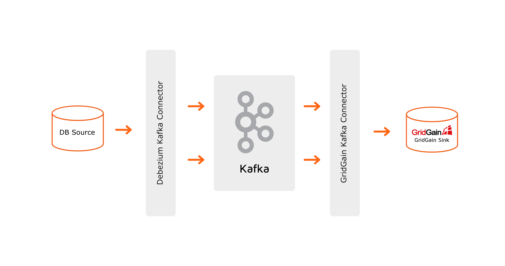

## Change-Data-Capture from MySQL to GridGain With Debezium
###

The demo shows CDC from MySql to GridGain using Debezium Connector for MySQL and GridGain Kafka Connector. Read this 
blog post for more details: https://www.gridgain.com/resources/blog/change-data-capture-between-mysql-and-gridgain-debezium

###
### Runnable scripts
* start.sh starts containers needed for demo.
* start_tools.sh starts additional containers with GUI tools.
* stop.sh stop all containers

###
### Containers
This demo has 4 containers:

	2 Gridgain Enterprise Edition cluster node containers (gridgain-node-1, gridgain-node-2).

	1 Kafka container - (gridgain-kafka) with configured connectors.

  	1 Mysql container - (sql) with database.
	
If you want to use GUI tools, you can also start these containers using start_tools.sh script:

	2 WebConsole containers - (gridgain-webconsole-backend) and (gridgain-webconsole-frontend)
	
	1 PhpMyAdmin container - (myadmin)

Once WebConsole started, you will need to download a webagent and connect it to the cluster. Please add this to the properties file in order to connect to the cluster started in the docker:

	server-uri=http://localhost

	node-uri=http://localhost:6081

More information about WebAgent configuration can be found in the documentation: https://www.gridgain.com/docs/web-console/latest/web-agent-configuration

Script downloads Kafka and debezium connector binaries if they are not in the package yet.

###
